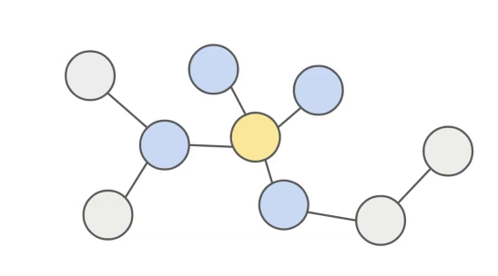
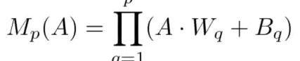
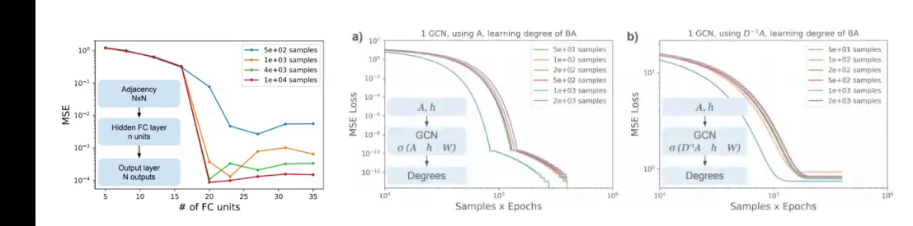
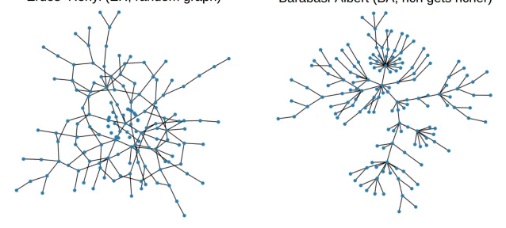
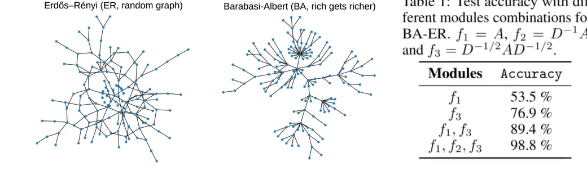
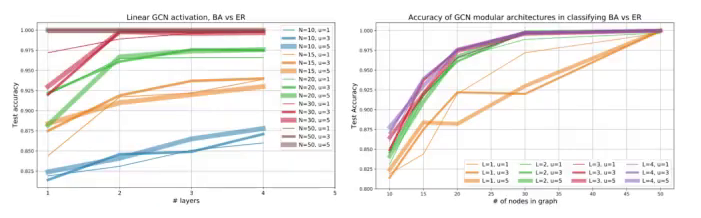
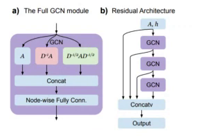
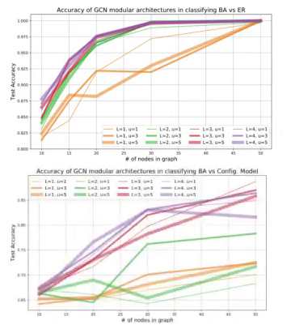
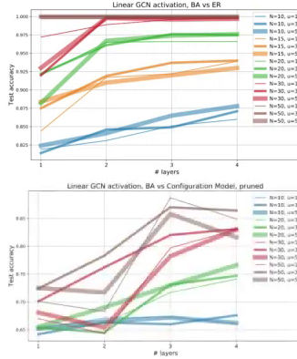
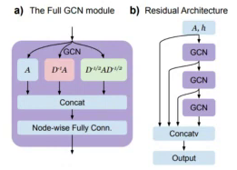

Markdown
========

# Understanding.mp4 OCR

## page-1

### Learning Graph Moments

- The adjacency matrix of a graph A encodes graph topology, where each element A, represents an edge from node # to node /. 

- Graph Moments: a pth order graph moment M, is the ensemble average of an order p polynomial of A 

  
  
  
\pagebreak  

## page-2

### Learning Graph Moments, 20 nodes, FC vs GCN

- e Fully Connected (FC) networks can approximate any function, but require large amounts 

  
  
\pagebreak  

## page-3

### Learning Graph Moments, 20 nodes, FC vs GCN

- e Fully Connected (FC) networks can approximate any function, but require large amounts 

  
  
\pagebreak  

## page-4

### Importance of multiple Propagation Rules (PR)

- e@ Multiple PR can significantly improve expressivity 

  
  
\pagebreak  

## page-5

### Importance of multiple Propagation Rules (PR)

- e@ Multiple PR can significantly improve expressivity 

  
  
\pagebreak  

## page-8

### Tests on Graph Classification Problems

- Figure 6: Classify graphs of Barabasi-Albert model vs. Erdos-Renyi model (top) and Barabasi- Albert model vs. configuration model (bottom). Left: test accuracy with respect to network depth for different number of nodes (N) and number of units (U). Right: test accuracy with respect to graph 

- size for different number of layers (L) and number of units (U). 

  
  
  
\pagebreak  

## page-9

### Tests on Graph Classification Problems

- i model (top) and Barabasi- 

- with respect to network depth 

- ph 

  
  
  
  
\pagebreak  

  
\pagebreak
# Understanding.mp4 STT

## Summary : 

While a fully connected graph requires large numbers of parameters and large amounts of data to learn even simple graph moments, a graph convolutional network can do so with very few number of parameters if it is given the correct propagation.
We show two results for learning graph moments of order P, first that the fully connected layer requires large amounts of data and parameters.
And the second that a GCN with sufficiently many number of layers can do so with order P number of parameters.
We then turn to the importance of the propagation rule examining it in the context of the simple classification problem between a random graph and a Barwashi Albert graph.
We find that combining multiple propagation rules leads to almost 100% accuracy in this context.
Motivated by these, we make the following suggestions to make your GCN architectures more expressive, versus to use multiple propagation rules and biases, then combine the outputs of those propagation rules using per node, fully connected layers.
We find it in the first task, we can reach almost 100% accuracy with sufficient number of layers.  
\pagebreak
## STT : 

 Graph convolutional networks have been used in many contexts such as WebSKare recommendation systems for learning physical dynamics and quantum chemistry. We want to address a problem of how well the graph neural networks learn graph topology. To do so, we look at the problem of learning different graph moments, which are polynomial of T-chase and C matrix of the graph, encoding various structural information about the graph. We will require that the features are node permutation invariant, meaning that they are invariant on the relabeling of the nodes. This will heavily restrict the type of neural network architectures that we can apply to the system, leading to the definition of graph convolutional networks, which share weights and biases among all nodes, or which are also restricted because of that as they cannot distinguish between different neighbors of the same node. While a fully connected graph requires large numbers of parameters and large amounts of data to learn even simple graph moments, a graph convolutional network can do so with very few number of parameters if it is given the correct propagation. Note, however, that if it has the wrong propagation rule shown in red here, it performs very poorly. So this leads to the question of how restrictive are GCN and how can we make them more expressive? We show two results for learning graph moments of order P, first that the fully connected layer requires large amounts of data and parameters. And the second that a GCN with sufficiently many number of layers can do so with order P number of parameters. We show that a GCN, that is too shallow, is incapable of learning higher order graph moments. We then turn to the importance of the propagation rule examining it in the context of the simple classification problem between a random graph and a Barwashi Albert graph. We find that combining multiple propagation rules leads to almost 100% accuracy in this context. Motivated by these, we make the following suggestions to make your GCN architectures more expressive, versus to use multiple propagation rules and biases, then combine the outputs of those propagation rules using per node, fully connected layers. And finally, we use skip layers to increase the number of functions expressible by your architecture. We examine the effectiveness of this modular design and two classification problems. The first, a random graph versus a Barwashi Albert rich gets richer model. And the second, comparing the BA with a configuration model BA, which has its links shuffled. The second task is very difficult as many of the graph moments between the real and the fake version of the BA look very similar. We find it in the first task, we can reach almost 100% accuracy with sufficient number of layers. And in the second task, we also reach an impressive 85% accuracy. In both cases, we observe that the number of layers are much more influential in the performance than the width of the layers. In conclusion, we find that GCN are very powerful for learning graph moments. And that they can be made much more expressive by combining multiple propagation rules and having sufficient depth.